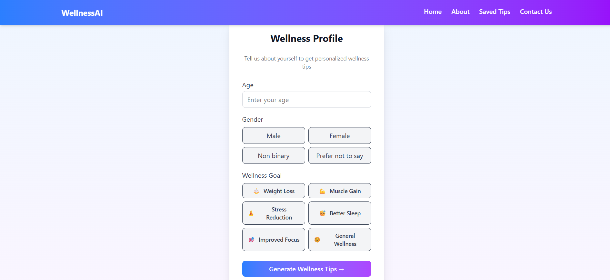

# AI-Generated Wellness Recommendation Board

## 1. Project Setup & Demo

**Web Setup (React + Vite):**

```bash
# Install dependencies
npm install

# Run the development server
npm run dev

# Build for production
npm run build

# Preview production build
npm run preview

# Lint the code
npm run lint
```

**Dependencies:**

* `react`, `react-dom`, `react-router`
* `openai` (for AI-powered wellness tips)

**Dev Dependencies:**

* `vite`, `@vitejs/plugin-react`
* `eslint`, `@eslint/js`, `eslint-plugin-react-hooks`, `eslint-plugin-react-refresh`
* TypeScript typings: `@types/react`, `@types/react-dom`

**Demo:**

* Provide a hosted web link (Vercel/Netlify) or screen recording showcasing:

  1. Profile capture
  2. AI-generated tips
  3. Detailed tip view
  4. Saving favorites locally

---

## 2. Problem Understanding

**Objective:**
Display a personalized board of health tips and allow users to explore and save them.

**Expected Flow:**

1. **Profile Capture:** Users input age, gender, and goal selection.
2. **AI Tip Generation:** Generate 5 health tips displayed as scrollable cards with icons and short titles.
3. **Detailed Advice:** Tapping a card displays longer explanations with step-by-step guidance.
4. **Favorites:** Users can save favorite tips locally for later reference.

**Assumptions:**

* Users want concise, personalized wellness recommendations.
* Local storage is sufficient for persisting favorites.
* AI prompts generate readable, engaging, and actionable tips.

---

## 3. AI Prompts & Iterations

* **Initial Prompt:** Generate general health tips without personalization.
* **Issues Faced:** Tips were generic and not tailored to user profile.
* **Refined Prompt:** Include age, gender, and goal in prompts to create personalized, actionable tips.
* **Additional Feature:** Regenerate option for fresh tips per user request.

---

## 4. Architecture & Code Structure

* **Entry Point:** `App.tsx` manages navigation between screens using `react-router`.
* **Screens / Components:**

  * `ProfileScreen.tsx` – User profile capture
  * `TipsBoardScreen.tsx` – Scrollable AI-generated tip cards
  * `TipDetailScreen.tsx` – Detailed advice per tip
* **AI Integration:** `aiService.ts` handles API calls to OpenAI for generating tips.
* **State Management:** React Context to manage global state (user profile, saved tips).
* **Folder Structure (example):**

```
src/
 ├─ components/
 │   ├─ TipCard.jsx
 │   └─ Header.jsx
 |   |__LoadingSpinner.jsx
 |   |__ErrorModal.jsx
 ├─ pages/
 │   ├─ SavedTipsPage.jsx
 │   ├─ TipDetailPage.jsx
 │   └─ TipsPage.jsx
 ├─ services/
 │   └─ GeminiService.jsx
 ├─ App.jsx
 └─ main.jsx
```

---

## 5. Screenshots / Screen Recording

Here are some screenshots showcasing the app functionality:

**1. Profile Capture Screen**  


**2. Scrollable Tips Board**  


**3. Detailed Tip View (Step-by-Step Guidance)**  
 


---

## 6. Known Issues / Improvements

* Some AI tips may occasionally be generic.
* Mobile responsiveness can be enhanced.
* Improvements with more time:

  * Cloud-based persistence for favorites.
  * Dark mode and animations for better UX.
  * Improved AI prompt engineering for highly personalized recommendations.

---

## 7. Bonus Work

* Scrollable card UI for tips with icons.
* Local storage integration for saving favorites.
* Clean React + Vite setup with ESLint and fast refresh (HMR) for development efficiency.
* Optional regenerate feature to fetch new AI-generated tips.
